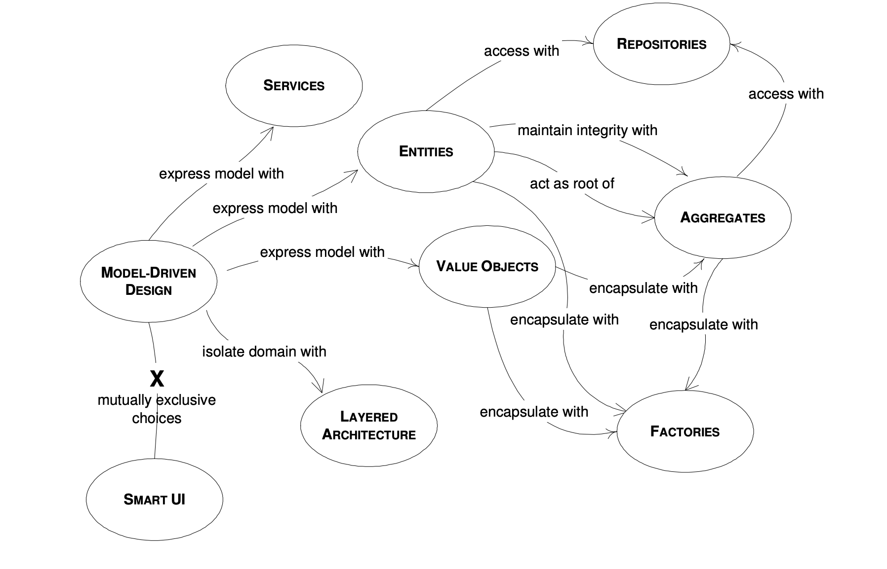

# Model Driven Design
The previous chapters undescore the importance of an approach to software development that is centered on the business domain and emphasized the fundamental importance to create a model which is deeply rooted in the domain, and should reflect the essential concepts of the domain with great accuracy

The Ubiquitous Language should be fully exercised throughout the modeling process in order to faciliate communication between the software specialists and the domain experts, and to discover key domain concepts which should be used in the model

The purpose of this modeling process is to create a good model, the next step is to implement the model in code, this is an equally important phase of the software development process, having created a great model but failing to properly transfer it into code will end up in software of questionable quality

Any domain can be expressed with many models, and any model can be expressed in various ways in code, for each particular problem there can be more than one solution, which one do we choose?

Having one analytically correct model does not mean the model can be directly expressed in code, or maybe its implementation will break some software design principles, which is not advisable, it is important to choose a model which can be easily and accurately put into code

## How do we Approach the Transition from Model to Code?
One of the recommended design techniques is the so called **analysis model**, which is seen as separate from code design and is usually done by different people, the analysis model is the result of business domian analysis, resulting in a model which has no consideration for the software used for implementation, such a model is used to understand the domain

A certain level of knowledge is built, and the model resulting may be analytically correct, but software is not taken into account at this stage, however when the model reaches the developers, the developers will have to adapt to it or create a separate design, which destroys the mapping between the model and code, the result is that the anaylsis model is abandoned after codinf starts

One of the main issues with this approach is that analysts cannot foresee some of the defects in their model and all the intricacies of the domain, the analysts may have gone into too much detail with some of the components of the model, and have not detailed enough others, very important details are discovered during the design and implementation process, a model that is truthful to the domain could turn out to have serious problems with object persistence, or unacceptable performance behaviour

A better approach is to closely relate domain modeling and design, the model should be constructed with an eye open to software and design considerations, developers should be included in the modeling process, getting the developers involved provides feedback, it makes sure the model can be implemented in software

If the design or some central part of it does not map to the domain model, that model is of little value, and the correctness of the software is suspect

## OOP and Procedural Languages
Object-oriented programming is suitable for model implementation because they are both based on the same paradigm, object-oriented programming provides classes of objects and associations of classes, object instances, and messaging between them

OOP languages make it possible to create direct mappings between the model object with their relationships, and their programming counterparts

Procedural languages offer limited support for model-driven design, such languages do not offer the constructs necessary to implement key components of a model, some say that OOP can be done with a procedural language like C, and indeed, some of the functionality can be reproduced that way, objects can be simulated as data structures, but such a program can not easily encapsulate the conceptual connections, making mapping between domain and code difficult to realize

Overall, procedural programming is not recommended for model-driven design

## Building Blocks of a Model Driven Design
The following sections of this chapter will present the most important patterns to be used in model-driven design, the purpose of these patterns is to present some of the key elements of object modeling and software design from the viewpoint of domain-driven design

The following diagram is a map of the patterns presented and the relationships between them

This is a bit hard to understand, so let's break this diagram down!

1. Model-Driven Design
The central concept in Domain-Driven Design is that software is built around a model model, you can either build your system with model driven design or use simpler approaches such as Smart UI this is *mutually exclusive*

2. Entities: Objects defined by their identity, not just their attributes, they represent key domain concepts are are identified by a unique identifier

Example: A custoemr in a system has a unique ID that distinguishes them from other customers, this is an entity

Relationships:
- Aggregates: Entities often act as the root of aggregate, grouping related entities and value objects into a single consistency boundary
- Repositories: Entities are accessed and managed through their repositories, which handle storing and retrieving them
- Services: Certain domain logic that does not naturally fit into entities or value objects can be expressed through services

3. Value Objects: Value objects are immutable and defined by their attributes rather than identity, they don't have a unique identity and are interchangeable if their attributes are the same

Example: An amount of money is a value object, $10 is the same as another $10, these don't need to be kept track of uniquely

Relationships:
- Entities: Entities can contain or use value objects as part of their data
- Aggregates: Value objects are often part of aggregates, providing additional context or details
- Factories: Factories might create value objects, especially if their creation is complex

4. Aggregates: A cluster of related objects (entities and value objects) that are treated as a single unit for data changes, each aggregate has a root entity that controls access to the other objects within the cluster

Example: An order might include items (entities or value objects) and shipping details, when you update an order, you interact with the order aggregate, ensuring all related changes are consistent

Relationships:
- Entities: The aggregate root is an entity that manages the entire aggregate
- Repositories: Aggregates are accessed through repositories, ,which ensure that only the aggregate root is directly handled
- Value Objects & Factories: They ensure that the aggregate remains consistent and valid

5. Repository: Collections that provide methods for storing and retrieving entities or aggregates, they abstract the data storage details, allowing the domain model to remain focused on business logic

Example: The customer repository may have methods such as `addCustomer(Customer customer)` or `findCustomerById(String id)`

Relationships:
- Entities and Aggregates: Repositories handle the persistence and retrieval of entities and aggregates

*For some clarficiation these are not code repositories or databases, they are an abstraction that provides an interface for storing and retrieving domain objects*

6. Factories: Factories are responsible for creating complex objects (entities or value objects), they encapsulate the creation logic, ensuring that objects are properly constructed without burdening the domain model

Example: OrderFactory might handle the creation of an order along with its initial order items, ensuring all necessary data is correctly set up

Relationshups: Entities, Objects, Aggregates are created by factories, especially when their creation involves multiple steps or rules

7. Services: Contains domain logic that doesn't naturally fit within entities or value objects, they perform operations or calculations that are part of the domain

Example: PaymentService: This might handle processing payments, a task that involves multiple entities and doesn't belong to any single one

Relationships:
- Entities, Value Objects, Aggregates: Services interact with these to perform their operations, often coordinating multiple parts of the domain model

8. Layered Architecture: A layered architecture divides the system into different layers, each with a specific responsibility, common layers include:
- Domain layer: Contains the domain model
- Application layer: Coordinates the application activities
- Infrastructure layer: Deals with technical details like databases, messaging, and external services

## Putting It All Together
Imagine you're building an online bookstore, here's how these DDD components may interact with each other
- Domain Model: The bookstore's business logic, including customers, books, orders, payments, etc
- Entities:
    - Customer: Identified by a unique customer ID
    - Order: Identified by a unique order ID
    - Book: Identified by a unique book ID
- Value Objects:
    - Money: The prices and payment amounts
    - Address: A customer's shipping address
- Aggregates:
    - Order Aggregate: Includes the order itself (aggregate root), order item, and shipping details
- Repositories:
    - OrderRepository: Handles storing and retrieving orders
    - Customer Repository: Manages customer entities
- Factories:
    - OrderFactory: Creates new orders with initial items and shipping details
- Services:
    - PaymentService: Processes payments when a customer places an order
- Layered Architecture:
    - Domain Layer: Contains all the above domain elements such as entities and domain services
    - Application Layer: Managees the process of placing an order, managing customers
    - Infrastructure: Interfaces with the database to store orders and customers
