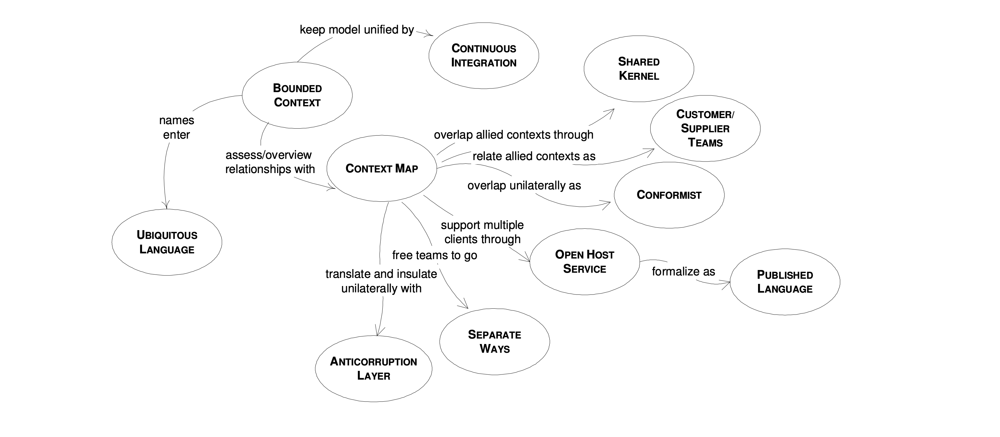

# Preserving Model Integrity
This chapter is about large projects which require the combined effort of multiple teams

We are faced with a different set of challenges when multiple teams, under different management and coordination are set on the task of developing a project

Enterprise projects are usually large projects, which employ various technologies and resources, the design of such projects should still be based on a domain model, and we need to take appropriate measure to ensure the success of the project

When multiple teams work on a project, code development is done in paralle, each team being assigned a specific part of the model

Those parts are not independent, but are more or less interconnected, each team being assigned a specific part of the model, they all start with one big model, and they are given a share of it to implement

Let's say that one of the teams has created a module, and they make it available for other teams to use, a developer from another team starts using the module, and discovers that it is missing some functionality needed for his own module, he adds the needed functionality and checks-in the code so it can be used by all

What he might not realize is that this is actually a chance of the model, and it is quite possible that this change will break application functionality, this can easily happen, as nobody takes the time to fully understand the entire modle, everybody knows his own backyard, but other areas are not known in enough detail

It is easy to start from a good model and progress toward an inconsistent one, the first requirement of a model is to be consistent, with invariable terms and contradictions, the internal consistency of a model is called **unification**

An enterprise project could have one model covering the entire domain of the enterprise, with no contradictions and overlapping terms, a unified enterprise model is an ideal which is not easily accomplished, and sometimes it is not even worth trying

Such projects need the combined effort of many teams, the teams need a large degree of independences in the development process, because they do not have the time to constantly meet and discuss the design

The coordination of such teams is a daunting task, they might belong to a different department and have separate management, when the design of the model evolves partially indepdently, we are facing the possibility to lose model integrity

Preserving the model integrity by striving to maintain one large unified model for the entire enterprise is not going to work, the solution is not so obvious, because it is the opposite of all we have learned so far

Instead of trying to keep one big model that will fall apart later, we should consciouly divide it into several models, several models well integrated can evolve independently as long as they obey the contract they are bound to, each model should have a clearly delimited border, and the relationships between models should be defined with precision

We will present a set of techniques used to maintain model integrity, the following diagram presents these techniques and the relationship between them

## Domain Relationship/Generalized Context Map

A context map is a strategic tool in domain driven design used to visualized and manage the relationships between different parts of a software system known as **bounded contexts**, think of it as a blueprint or roadmap that outlines how various components of your system interact, collaborate, and depend on each other

### Bounded Context
A bounded context is a defined boundary within which a particular domain is applicable, this can be thought of as a distinct area of your software where specific terms, rules, and logic are consistent and well-defined

In large systems, different parts may have overlapping or even conflicting terminology and logic, a bounded context ensures that within its boundaries, everyone uses the same language and understands the domain in the same way, reducing confusion and errors

Key Relationships
- Ubiquitous Language: Inside a bounded context, the ubiquitous language is the shared vocabulary used by all team members (developers, domain experts, stakeholders)
- Continus integration: Within a bounded context, continuous integration ensures that all changes to the model are regularly merged and tested, maintaining consistency and preventing integration issues

Imagine a large organization with multiple departments: Sales, Support, Billing, and Shipping, each department has its own process and terminology, by defining a bounded context for each department, you ensure that the Sales team's understanding of Customer doesn't interfere with the Support's team understanding which may include additional attributes like support tickets

### Context Map
A context map is a visual representation that shows how different bounded contexts interact and relate to each other within a system, it outlines the dependencies, communication patterns, and integration points between context

Key Relationships:
- Bounded Context: The context map includes all the bounded contexts within the system and how they interrelate
- Anticorruption Layer (ACL): An ACL is used within the context map to mediate communication between bounded contexts, translating or insulating one context from another to prevent corruption of the model
- Separate Ways: Represents bounded contexts that intentially do not interact, allowing teams to work indepedently without dependencies
- Open Host Service: An interface or API provided by one bounded context that can be used by multiple other contexts or external clients

Example: Consider an online marketplace with the following bounded contexts
- User management
- Product catalog
- Order processing
- Payment
- Shipping

The context map would show:
- User management interacts with order processing to authenticate users
- Order processing communicates with payment via an ACL to handle transactions
- Seperate ways: User management and shipping do not directly interact with each other, as their operations are independent

### Continuous Integration
Continuous integration is a development practice where team members frequently merge their code changes into a shared repository, often multiple times a day, automated builds and tests run to detect integration issues early

CI helps maintain a unified and consistent model within a bounded context, it prevents conflicts and ensures that the system remains stable as new features and changes are introduced continously

Key Relationships:
- Bounded context: CI practices are applied within each bounded context to ensure that its model remains consistent and up to date

Example: A Customer Service bounded context where multiple developers are working on different aspects like ticket creation, status updates, and customer communications, using CI each developer's changes are automatically tested and integrated into the main branch, if one developer's change introduces a bug in the ticket status update feature, the CI system will detect it, allowing for quicj resolution before it affects the entire system

### Anticorruption Layer (ACL)
An anticorruption layer is a design pattern used to translate or mediate communication between two bounded contexts, it acts as a buffer that prevents one context's model and language form "corruptng" another's

Key Relationships:
- Context Map: The context map identifies where an ACL is needed to manager interactions between bounded contexts
- Bounded Context: The ACL protects the internal model of a bounded context by handling external data translations

Example: Suppose there is a legacy system that handles customer data and a new CRM bounded context that manages customer interactions, to integrate them create an ACL that translates data between the Legacy System's format and the CRM's format such that the CRM can use customer data without being tightly coupled to the legacy system's internal model

### Separate Ways
Separate Ways is a strategic decision to keep bounded contexts entirely isolated from each other, this means there are no dependencies or interactions between these contexts, allowing teams to work independently

Key Relationships:
- Context Map: The context map uses separate ways to denote bounded contexts that do not interact or depend on each other

### Open Host Service (OHS)
An Open Host Service is an exposed interface or API provided by a bounded context that allows multiple clients or other contexts to interact with it, it servces as a standardized entry point for communication, OHS promotes reusability and decouples clients from the internal implementation details of providing context, it allows various consumes to interact with the service without being tightly coupled to its internal model

Key Relationships:
- Context Map: The context map shows where open host services are used to faciliate communication between bounded contexts
- Published Language: OHS often uses a Published Language to formalize the communication protocals, ensuring consistency and clarity

Example: Consider a Notification bounded context that handles sending emails and SMS messages by providing an OHS, sales can send, sales can send order confirmations via email, support can send password reset links via SMS

### Published Language
Published Language is a formalized and shared language used for communication between bounded contexts, it is typically implemented through schemas, APIs, or message contracts that define how data is structured and exchanged

Key Relationships:
- Open Host Service: The OHS utilizes the Published Language to define how clients should interact with a service

### Shared Kernel
A Shared Kernel is a small, shared portion of the domain model or codebase that is used by two or more bounded contexts, it includes common elements that are essential for the interacting contexts

Key Relationships:
Customer/Supplier Teams: Teams that share a kernel must collaborate closely to maintain and evolve the shared element without causing disruptions

Example: The Sales and Billing teams might share a kernel that includes the definition of Customer and Address, ensuring both contexts use the same structure for customer data

### Customer/Supplier Teams
The Customer/Supplier relationship describes the dynamic where one team (the Supplier) provides a service, model, or component that another team (the Customer) consumes

Key Relationships:
- Shared Kernel: The Shared Kernel is often a part of the Customer/Supplier relationship, where shared elements are maintained collaboratively
- Contact Map: The Context Map highlights the customer/supplier relationship, showing dependencies and interactions between bounded contexts

### Conformist
A Conformist relationship occurs when one bounded context adopts the model and terms of another context without significant changes, essentially the Conformist context conforms to the Supplier context's definitions and structures, this simplifies integration by reducing the need for translation layers, though it can limit flexibility as the Conformist is tightly coupled to the Supplier's model, it can also restrict the Conformist's ability to evolve independently

Key Relationships
- Context Map: The Context Map indicates a conformist relationship where one context unilaterally adopts another's model